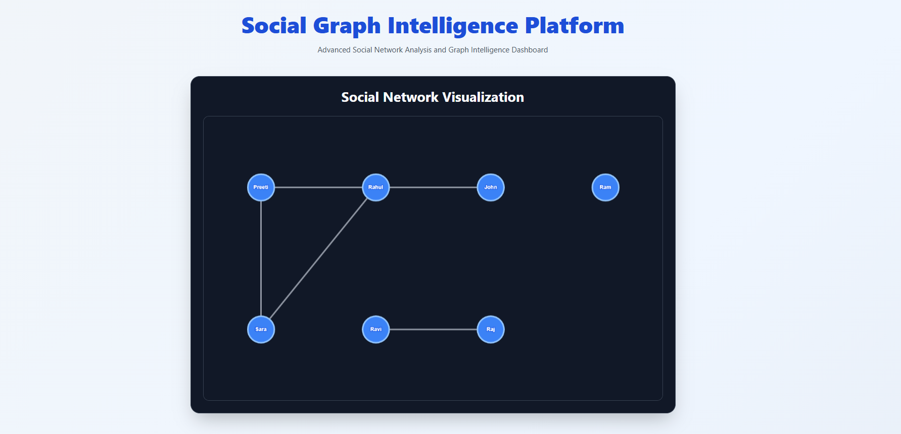
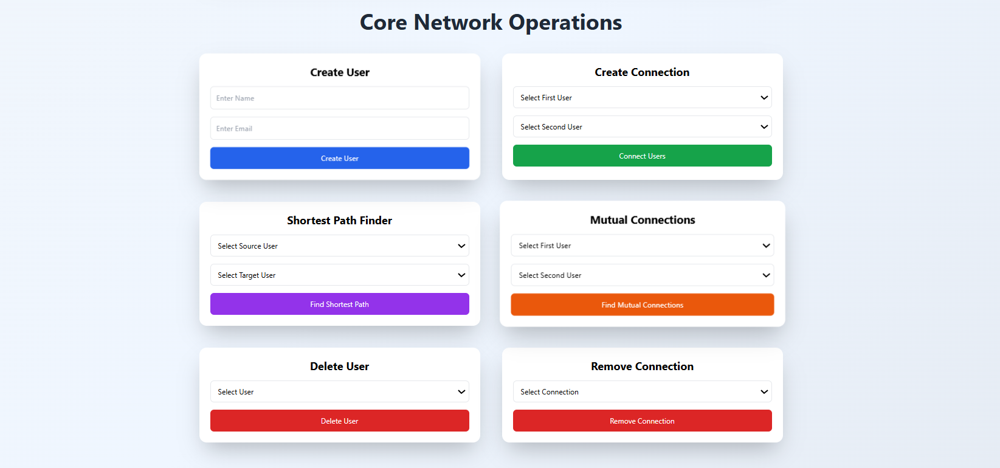
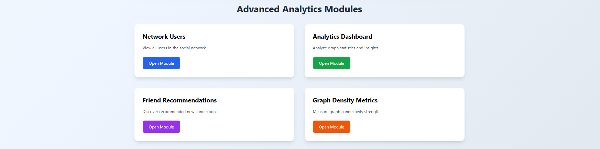
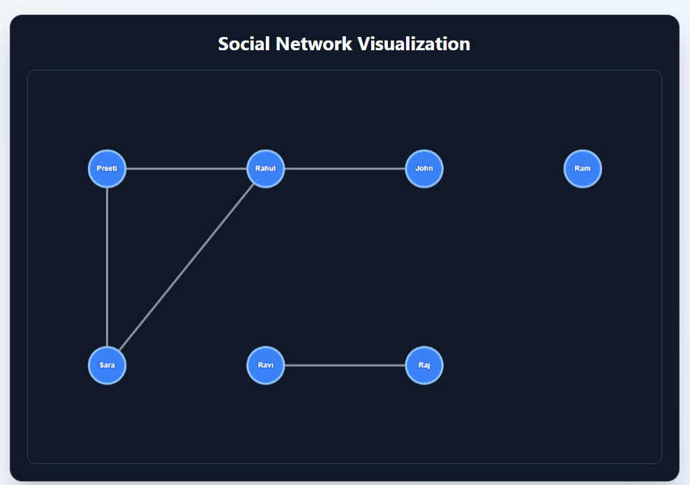
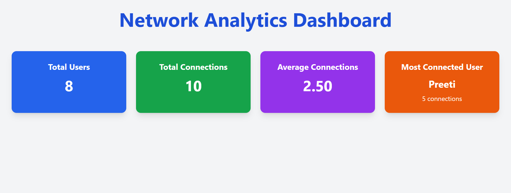
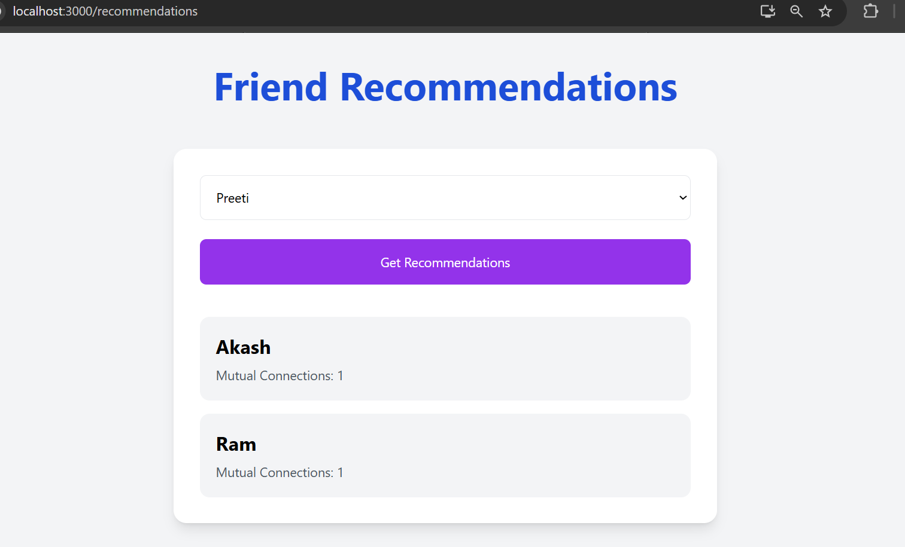
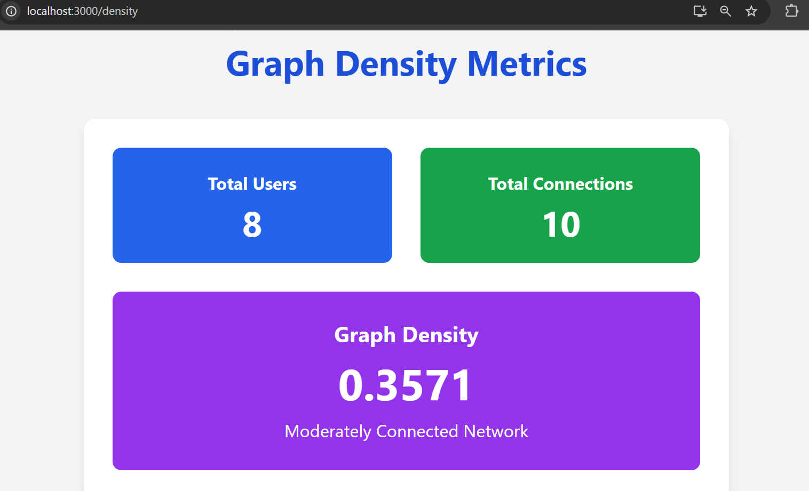

# Social Graph Intelligence Platform

An intelligent MERN Stack based social network analysis platform that visualizes user relationships as graphs and performs advanced graph analytics including shortest path analysis, mutual connections, friend recommendations, and network density metrics.

---

# Features

## Core Features

- Create Users
- Delete Users
- Create Connections
- Remove Connections
- Interactive Social Network Graph Visualization
- Shortest Path Finder using BFS
- Mutual Connections Detection

## Advanced Analytics Features

- Friend Recommendation System
- Network Analytics Dashboard
- Graph Density Metrics
- Most Connected User Analysis
- Average Connections Analysis

---

# Tech Stack

| Technology | Usage |
|------------|------|
| React.js | Frontend |
| Tailwind CSS | UI Styling |
| Node.js | Backend Runtime |
| Express.js | Backend Framework |
| MongoDB | Database |
| Mongoose | ODM |
| Axios | API Communication |
| Cytoscape.js | Graph Visualization |

---

# Project Architecture

```text
Frontend (React.js)
        ↓
REST API Calls (Axios)
        ↓
Backend (Node.js + Express.js)
        ↓
MongoDB Database
```

# Graph Algorithms Used

## Breadth First Search (BFS)

Used for:

- Shortest Path Finder
- Graph Traversal

## Mutual Connection Analysis

Used for:

- Identifying common neighbors
- Recommendation engine

## Graph Density Formula

```text
Density = 2E / V(V - 1)
```

Where:

- E = Number of Edges
- V = Number of Vertices

---

# Modules

## User Management

- Create user
- Delete user
- Email validation
- Duplicate prevention

## Connection Management

- Connect users
- Remove connections
- Duplicate edge prevention

## Graph Visualization

- Dynamic node-edge rendering
- Interactive graph layout
- Real-time updates

## Analytics Dashboard

Displays:

- Total users
- Total connections
- Average connections
- Most connected user

## Recommendation Engine

Suggests friends based on:

- Mutual connections
- Existing graph relationships

---

# Screenshots

## Home Page





---

## Social Graph Visualization



---

## Analytics Dashboard



---

## Friend Recommendation Module



---

## Graph Density Metrics



---

# Installation Guide

## Clone Repository

```bash
git clone https://github.com/your-username/social-graph-intelligence-platform.git
```

---

# Backend Setup

```bash
cd backend
npm install
npm start
```

---

# Frontend Setup

```bash
cd frontend
npm install
npm start
```

---

# Environment Variables

Create `.env` file inside backend folder:

```env
MONGODB_URI=your_mongodb_connection_string
PORT=5000
```

---

# API Endpoints

## User APIs

| Method | Endpoint | Description |
|--------|----------|-------------|
| GET | /api/users | Get all users |
| POST | /api/users | Create user |
| DELETE | /api/users/:id | Delete user |

---

## Connection APIs

| Method | Endpoint | Description |
|--------|----------|-------------|
| GET | /api/connections | Get all connections |
| POST | /api/connections | Create connection |
| DELETE | /api/connections/:id | Remove connection |

---

## Graph APIs

| Method | Endpoint | Description |
|--------|----------|-------------|
| GET | /api/graph/shortest-path/:source/:target | Find shortest path |
| GET | /api/graph/mutual-connections/:u1/:u2 | Find mutual connections |
| GET | /api/graph/recommendations/:id | Friend recommendations |
| GET | /api/graph/analytics | Network analytics |
| GET | /api/graph/density | Graph density metrics |

---

# Future Enhancements

- Real-time graph updates using WebSockets
- AI-based recommendation engine
- Community detection algorithms
- Authentication and authorization
- Interactive graph editing
- Cloud deployment
- Graph clustering analysis

---

# Learning Outcomes

This project demonstrates:

- Graph Data Structures
- Graph Algorithms
- Full Stack MERN Development
- REST API Development
- Graph Visualization
- Recommendation Systems
- Network Analytics
- Dynamic CRUD Operations

---

# Author

## Preeti Rajakumar Kotabagi

Computer Science Engineering Student  
Aspiring MERN Stack Developer | Graph Algorithms Enthusiast

---

# License

This project is developed for educational and learning purposes.
